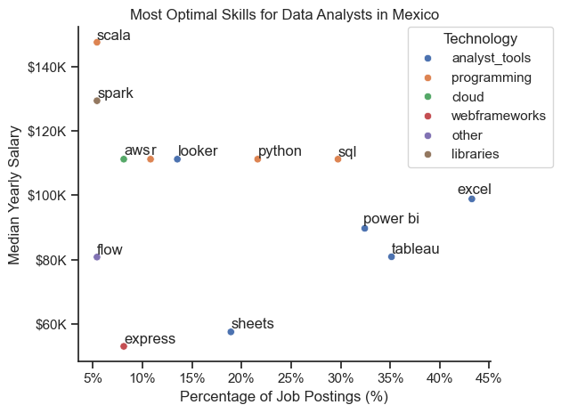

# The Analysis
## 1. What are the most demanded skills for the top 3 most popular data roles?

To find the most demanded skills for he top 3 most popular data roles, I filtered out those positions by which ones were the most populars and got the top 5 skills requested for those roles. This query highlights the most popular job titles with their top skills.

View the detailed steps in my notebook: [2_Skills_Count.ipynb](2_Skills_Count.ipynb)

### Visualize Data
```python
fig, ax = plt.subplots(len(job_titles), 1)

for i, job_title in enumerate(job_titles):
    df_plot = df_skills_percent[df_skills_percent['job_title_short'] == job_title].head(5)
    sns.barplot(x='skill_percentage', y='job_skills', data=df_plot, ax=ax[i], legend= False, hue = 'skill_count', palette='dark:g_r')
    ax[i].set_title(job_title)

fig.suptitle('Skills Requested in Mexico Job Postings', fontsize=16)    
```
### Results


### Insights
* `Python` is a versatile skill, highly demanded across all three roles, but most prominently for Data Scientists and Data Engineers (62%).
* `SQL` is the most requested skill for Data Analysts and Data Engineers, however for Data Scientists is requested in over half the job postings of this role.
* Data Engineers require more specialized techical skills `(AWS, Azure, Spark)` compared to Data Analysts and Data Scientist who are expected to be proficient in more general data management and analysis tools `(Tableu)`.

## 2. How are in-demand skills trending for Data Analysts?
To find the top trending skills for Data Analysts, I filtered the data frame to include only that specific job title, sorted it by month and skill demand throughout the year, and extracted the top 5 skills based on their demand over time.

View the detailed steps in my notebook: [3_Skills_Trend.ipynb](3_Skills_Trend.ipynb)

### Visualize Data

```python
ax = plt.gca()
ax.yaxis.set_major_formatter(plt.FuncFormatter(lambda x, _: f'{x:.0f}%'))
for i in range(5):
    plt.text(11.2, df_percent.iloc[-1, i] + 0.15, df_percent.columns[i])
```

### Results


### Insights
* `SQL` remains the most consistently demanded skill throughout the year.
* `Excel` experienced a significant increase around April, surpassing `SQL`, although it shows a substantial decrease around May.
* Both `Tableau` and `Power BI` show relatively stable demand throughout the year with some fluctuations. `Python` shows a slightly higher demand compared to the other ones and also remains stable towards the year's end.

## 3. How well do jobs and skills pay for Data Analysts?
For this visualization, I extracted the top 6 jobs based on their average yearly salary and arranged them by median salary.

View the detailed steps in my notebook: [4_Salary_Analysis.ipynb](4_Salary_Analysis.ipynb)

### Visualize Data

```python
sns.boxplot(data=df_mexico_top6, x='salary_year_avg', y='job_title_short', order=job_order)
sns.set_theme(style='ticks')

plt.title('Salary Distribution for Top 6 Data Jobs in Mexico')
plt.xlabel('Yearly Salary')
plt.ylabel('')
plt.xlim(0, 300000)
plt.gca().xaxis.set_major_formatter('${x:,.0f}')
```
### Results


### Insights
* Senior Data Scientist and Senior Data Engineer have the highest median and upper-range salaries among the listed roles.
* The Data Analyst role has the lowest median salary, this reflects a more limited salary range, possibly due to it being an entry-level position.
* The Data Scientist role has one of the widest interquartile ranges, suggesting large variability in pay.

### Highest Paid and Most Demanded Skills for Data Analysts

### Visualize Data
```python
sns.barplot(data=df_top_pay, x='median', y=df_top_pay.index, ax=ax[0], hue='median', palette='dark:g_r')
ax[0].set_title('Top 10 Highest Paying Skills for Data Analyst in Mexico')

sns.barplot(data=df_top_skills, x='median', y=df_top_skills.index, ax=ax[1], hue='median', palette='dark:g_r')
ax[1].set_title('Top 10 Most Popular Skills for Data Analyst in Mexico')
```
### Results


### Insights
* The top graph shows specialized technical skills like `scala`, `spark` and `go` these are associated with higher salaries, suggesting that advanced technical proficiency can increase earning potential.
* The bottom graph highlights that foundational skills like `Python` and `SQL` are the most in-demand, even though they may not offer the highest salaries. Tis demonstrates the importance of these core skills for employability in data analysis roles.
* There's a notorious distinction between the highest paid skills and those that are the most in-demand. Data Analysts aiming to maximize their potential should consider developing a diverse skill set including skills from both graphs.

## 4. What is the most optimal skill to learn for Data Analysts?

View the detailed steps in my notebook: [5_Optimal_Skills.ipynb](5_Optimal_Skills.ipynb)

### Visualize Data
```python
sns.scatterplot(data=df_merged, x='skill_percentage',
                y='median_salary',
                hue='technology')
sns.set_theme(style='ticks')

# Adjust text labels to avoid overlap
texts = []
for i, text in enumerate(df_skills_demand.index):
    texts.append(plt.text(df_skills_demand['skill_percentage'].iloc[i],
                          df_skills_demand['median_salary'].iloc[i],
                          text))

adjust_text(texts, arrowprops=dict(arrowstyle='->', color='gray', lw=0.5))
```
### Results


### Insights
* `Scala` and `Spark` offer the highest median yearly salaries, but they appear in less than 10% of job postings.
* `Excel` appears in nearly 45% of job postings, making it the most in-demand tool, although its median salary is moderate.
* `Python` and `SQL` are both in 20-30% demand range and offer salaries above $100K, making them optimal skills in terms of both values and opportunity.

# Conclusion
This analysis offers a coprehensive overview of the data job market in Mexico, focusing on the most in-demand roles, trending skills, salary distributions, and optimal tools for Data Analysis.

This analysis highlights that Python and SQL are the most essential and well-balanced skills for Data Analysts in terms of demand and salary. While tools like Excel and Tableau remain widely used, they offer lower payment compared to more specialized skills like Scala ans Spark. Senior-level roles command the highest salaries. Overall, combining core skills with select advanced technologies can help analysts maximize both employability and earning potential.
